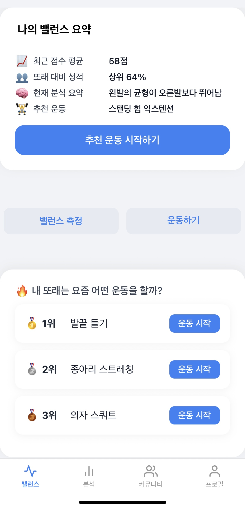
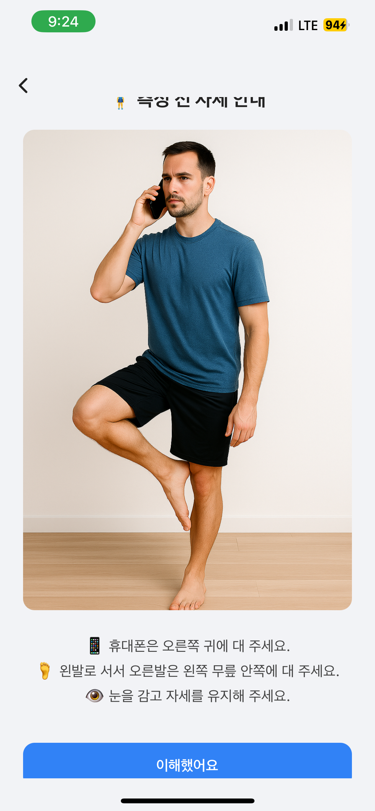
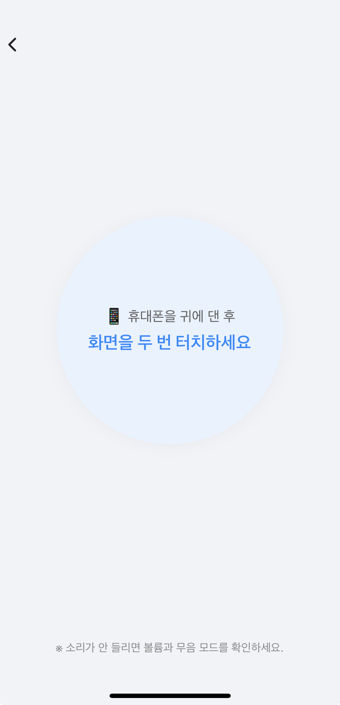
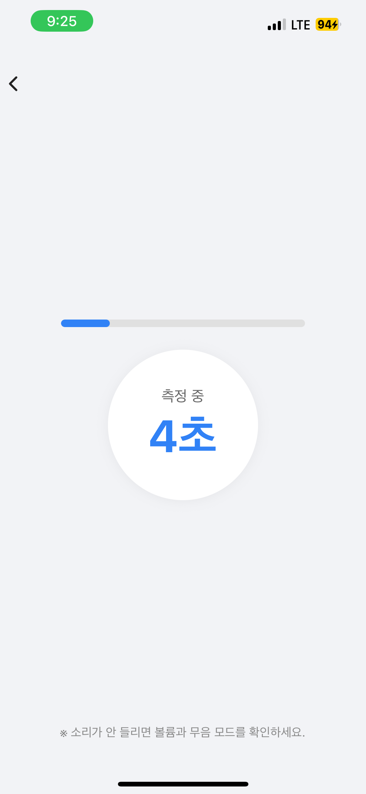
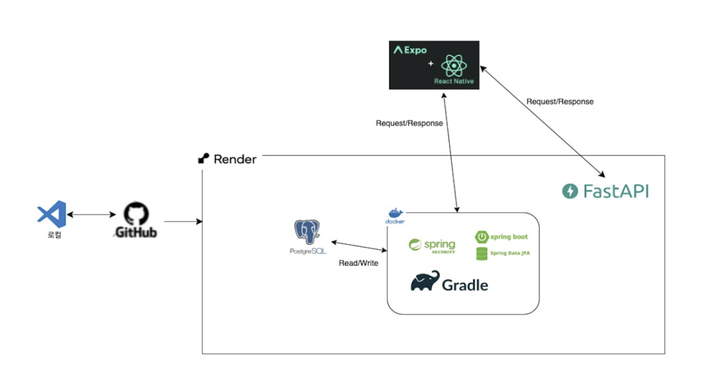

# JudeBalance

JudeBalance is a mobile application designed to help prevent falls in older adults by
measuring balance using smartphone sensors and providing personalised exercise recommendations.

The app guides users through a short balance test, analyses stability, and recommends
appropriate exercises based on individual balance performance.

---

## Demo

  
  

  
  

---

## Key Features

- Balance measurement using smartphone sensors (20-second fixed measurement)
- Stability-based balance score calculation
- Left and right foot balance distinction
- Personalised exercise recommendations based on balance scores
- Simple and accessible UI designed for older adults

---

## Tech Stack

- Typescript(React Native)
- Python(FastAPI)
- Java(Spring Boot)

---

## Architecture

The system is designed with a clear separation of responsibilities to improve scalability
and maintainability.

  

**Data Flow Overview**
1. The mobile app collects balance data using device sensors.
2. Balance scores and user profile data are sent to the AI recommendation server.
3. The recommendation server processes the data and returns personalised exercise suggestions.
4. Measurement results and recommendations are stored via the backend server.

---

## My Contribution

- Designed and implemented the balance measurement logic, including score calculation and data flow for stability assessment
- Developed the mobile frontend using React Native, implementing balance measurement, result visualisation, and recommendation UI
- Defined API specifications, data structures, and response formats
- Conducted end-to-end testing across the mobile app, AI server, and backend, identifying and resolving integration issues

---

## Challenges & Solutions

### Challenge: Limitations of time-based balance measurement
**Solution:**  
To overcome the limitations of manual, time-based balance measurement, the system was redesigned to use a fixed 20-second assessment and a stability-based scoring model derived from continuous sensor data.

The original approach measured how long users could maintain a one-leg stance by manually starting and stopping the test, which made results sensitive to reaction time, momentary slips, and user intervention. By standardising the measurement duration and analysing body sway throughout the full 20 seconds, the new method produces a balance score that reflects overall stability rather than endurance alone.

This shift improved measurement consistency, reduced user bias, and enabled fairer comparisons across users and sessions while also simplifying the user experience.

---

## Results

- Completed an end-to-end balance measurement and exercise recommendation flow
- Improved system modularity by separating AI logic into a standalone server
- Enabled personalised exercise recommendations tailored to individual balance performance
- Achieved smooth collaboration through clearly defined API contracts

---

## What I Learned

- Designing and implementing APIs in a multi-server architecture
- Translating sensor data into user-facing features
- Collaborating effectively across frontend, AI, and backend roles
- Structuring a project for maintainability and future expansion

---

